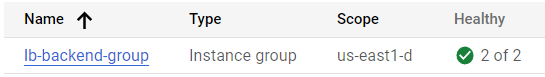
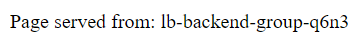

# GCP Load Balancer

> Projeto de um balanceador de carga simples usando o Google Cloud Load Balancing para distribuir solicitações entre instâncias de servidores.

### Etapas

Etapas necessárias para implementar um load balancer:

- [ ] Inicializar o Google Cloud Shell
- [ ] Definir região e zonas padrão
- [ ] Criar múltiplas instâncias de servidores webs que receberam os requests
- [ ] Configurar o serviço do Google Cloud Load Balancing
- [ ] Testar o Load Balancer utilizando o Curl
- [ ] Criar um Load Balancer HTTP para as requisições do serviço web
- [ ] Testar o Load Balancer HTTP utilizando o IP do Load Balancer para requests

## 💻 Pré-requisitos

Para implementar um Load Balancer no Google Cloud Platform, temos que garantir que:

- Você possui uma conta ativa do Google Cloud Platform com créditos de avaliação ou cartão de crédito cadastrado;
- Você possui um navegador compatível que consiga acessar o GCP Console e utilizar o Google Cloud Shell.

## 1 - 🚀 Ativando o Google Cloud Shell

Para ativar o Google Cloud Shell e conseguir executar os comandos direto pelo navegador é necessário clicar no canto superior direito na opção "Activate Cloud Shell "
Caso necessário, clique em "Continue" para confirmar a ativação

## 2 - 🚀 Definindo região e zona padrão

Para definir sua região e zona padrão, execute os seguintes comandos no Cloud Shell:

Definir a região padrão:

```
gcloud config set compute/region us-west1
```

Definir a zona padrão:

```
gcloud config set compute/zone us-west1-c
```

Caso necessário, clique em "Authorize" para autorizar o Cloud Shell a definir a região e zona padrão.

## 3 - ☕ Criando múltiplas instâncias de um servidor web

Para utilizarmos nosso load balancer em uma aplicação web, primeiramente precisamos ter vários servidores webs provendo o serviço, para isso iremos criar 3 instâncias do Google Compute Engine, cada uma com um servidor Apache, que possuirá sua home page indicando qual servidor respondeu o request, para isso, devemos executar os comandos:

Para criar a primeira instância, chamada Servidor1:

```
  gcloud compute instances create Servidor1 \
    --zone=us-west1-c \
    --tags=network-lb-tag \
    --machine-type=e2-small \
    --image-family=debian-11 \
    --image-project=debian-cloud \
    --metadata=startup-script='#!/bin/bash
      apt-get update
      apt-get install apache2 -y
      service apache2 restart
      echo "
<h3>Quem respondeu: Servidor1</h3>" | tee /var/www/html/index.html'
```

Para criar a primeira instância, chamada Servidor2:

```
  gcloud compute instances create Servidor2 \
    --zone=us-west1-c \
    --tags=network-lb-tag \
    --machine-type=e2-small \
    --image-family=debian-11 \
    --image-project=debian-cloud \
    --metadata=startup-script='#!/bin/bash
      apt-get update
      apt-get install apache2 -y
      service apache2 restart
      echo "
<h3>Quem respondeu: Servidor2</h3>" | tee /var/www/html/index.html'
```

Para criar a primeira instância, chamada Servidor3:

```
  gcloud compute instances create Servidor3 \
    --zone=us-west1-c \
    --tags=network-lb-tag \
    --machine-type=e2-small \
    --image-family=debian-11 \
    --image-project=debian-cloud \
    --metadata=startup-script='#!/bin/bash
      apt-get update
      apt-get install apache2 -y
      service apache2 restart
      echo "
<h3>Quem respondeu: Servidor3</h3>" | tee /var/www/html/index.html'
```

Observe que além dos parâmetros comuns para a criação de uma instância do Compute Engine, definimos também uma tag chamada "network-lb-tag", que nos permitirá adicionar regras de firewall e outras configurações para todas as instâncias de uma vez. O parâmetro `---metadata=startup-script` define um script a ser executado após a criação das instâncias, e nesse caso está instalando o servidor web Apache e configurando uma home page indicando cada servidor.

### 3.1 - Configurar Firewall para permitir requisições da internet

Para ser possível enviar requisições externas para os servidores web que criamos, é necessário configurar uma regra de firewall para permitir tráfego externo. Como definir uma tag anteriormente, podemos configurar essa regra com apenas um comando:

```
gcloud compute firewall-rules create www-firewall-network-lb \
    --target-tags network-lb-tag --allow tcp:80
```

### 3.2 - Testar os servidores

Para testar que nossos servidores estão funcionais e respondendo a requisições, precisamos consultar seus endereços IP externos e realizar uma requisição de teste.

Para consultar os endereços IP externos, podemos rodar o seguinte comando, que irá retornar os dados de cada instância:

```
gcloud compute instances list
```

O endereço externo de cada instância deverá estar listado como "EXTERNAL_IP"

De posse dos três endereços IP externos, podemos utilizar uma ferramenta de linha de comando para realizar uma requisição de teste para cada servidor:

```
curl http://<EXTERNAL_IP>
```

Ou podemos simplesmente acessar o endereço externo com algum navegador da web:

```
http://<EXTERNAL_IP>
```

Devemos receber a mensagem "Quem respondeu: Servidor<x>", onde x é o número do servidor que respondeu, confirmando que todos os três servidores web estão funcionais.

## 4 - Configurando o serviço do Google Cloud Load Balancing

Chegou a hora de configurar nosso Load Balancer! Primeiramente devemos criar um endereço de IP externo para o Load Balancer, que será o endereço que deverá receber as requisições para distribuí-las entre nossos servidores. Para isso, utilizamos o seguinte comando:

```
gcloud compute addresses create network-lb-ip-1 \
  --region us-west1
```

Após isso, devemos criar um "Health Check", que é um serviço gerenciado do GCP que garante que nossos servidores se manterão funcionais e com integridade. Para isso, utilizamos o comando:

```
gcloud compute http-health-checks create basic-check
```

Tendo o Health Check, deveremos associá-lo aos nossos servidores. Porém, para fazer isso, devemos criar uma "Target Pool", que nada mais é que um grupo de servidores que será alvo de algum serviço, em nosso caso, alvo do Load Balancer e do Helath Check, para isso, utilizaremos o comando:

```
gcloud compute target-pools create www-pool \
  --region us-west1 --http-health-check basic-check
```

E utilizaremos o comando abaixo para adicionar nossos servidores ao nosso Target Pool (www-pool):

```
gcloud compute target-pools add-instances www-pool \
    --instances Servidor1,Servidor2,Servidor3
```

E por fim, devemos criar uma regra que irá encaminhar todas as requisições enviadas para o nosso Load Balancer, para a nossa "Target Pool", distribuindo as requisições conforme recebimento. Para isso, podemos utilizar o comando:

```
gcloud compute forwarding-rules create www-rule \
    --region  us-west1 \
    --ports 80 \
    --address network-lb-ip-1 \
    --target-pool www-pool
```

### 4.1 - Testando o Load Balancer

Para testar o nosso Load Balancer, precisamos primeiro consultar qual o endereço IP da nossa regra que encaminha para o Load Balancer, pois será esse o IP que deverá receber as requisições. Para isso, podemos consultar a regra que criamos usando o comando:

```
gcloud compute forwarding-rules describe www-rule --region us-west1
```

O comando retorna todas as informações da regra de encaminhamento, mas o que queremos é apenas o endereço IP, ou seja, o campo "IPAddress".

Com esse endereço IP, podemos verificar que nosso Load Balancer está funcional para requisições externas realizando várias requisições. Para fazer isso usando o curl, podemos usar o seguinte comando:

```
while true; do curl -m1 <IPAdress>; done
```

Substituindo <IPAddress> pelo endereço de IP que foi retornado no comando anterior. Aperte Ctrl + C para interromper a execução.

O retorno dos vários comandos curl deverá ser de cada servidor alternadamente, o que indica que nosso Load Balancer está funcional.

## 5 - Implementando o Load Balancer HTTP

Apesar de já existir um Load Balancer que criamos, o mesmo não é o indicado para aplicações HTTP(S). Para isso, o método indicado é utilizando o serviço chamado Google Front End (GFE). GFEs são distribuídos globalmente e não apenas em uma região. Além disso, podem ser configurados para determinados Links da aplicação realize requisições para determinados grupos de servidores, tornando o Load Balancer muito mais configurável e robusto.
Requisiçõs para um GFE são sempre enviados para o grupo de servidores mais próximo, e caso esse grupo não tenha capacidade, a requisição é enviada para outro grupo que possua capacidade, isso aumenta muito a resiliência do sistema.

Para implementarmos um Load Balancer em um GFE, precisamos que nossos servidores estejam em um "Managed Instance Group" ou MIG. Que é um serviço gerenciado do GCP que automaticamente provê servidores para suprir as requisições oriundas do Load Balancer.

Para iniciar a implementação, devemos primeiro criar um Template para o Load Balancer, podemos criar com o seguinte comando:

```
gcloud compute instance-templates create lb-backend-template \
   --region=us-west1 \
   --network=default \
   --subnet=default \
   --tags=allow-health-check \
   --machine-type=e2-medium \
   --image-family=debian-11 \
   --image-project=debian-cloud \
   --metadata=startup-script='#!/bin/bash
     apt-get update
     apt-get install apache2 -y
     a2ensite default-ssl
     a2enmod ssl
     vm_hostname="$(curl -H "Metadata-Flavor:Google" \
     http://169.254.169.254/computeMetadata/v1/instance/name)"
     echo "Page served from: $vm_hostname" | \
     tee /var/www/html/index.html
     systemctl restart apache2'
```

Esse template servirá de base para criarmos o nosso MIG, e ele possui um servidor Apache similar ao outro Load Balancer, que indica qual servidor respondeu a requisição.

Para criarmos o nosso MIG que será nossos servidores, podemos usar o comando:

```
gcloud compute instance-groups managed create lb-backend-group \
   --template=lb-backend-template --size=2 --zone=us-west1-c
```

O argumento size indica a quantidade de servidores que queremos que sejam criados inicialmente.

Similarmente ao Load Balancer anterior, precisaremos de um Health Check, e para isso, devemos configurar uma regra no firewall:

```
gcloud compute firewall-rules create fw-allow-health-check \
  --network=default \
  --action=allow \
  --direction=ingress \
  --source-ranges=130.211.0.0/22,35.191.0.0/16 \
  --target-tags=allow-health-check \
  --rules=tcp:80
```

Essa regra permite que o serviço "Google Cloud health checking systems" envie tráfico, que permite que o GCP verifique se os servidores estão funcionais.

Tendo a regra, podemos criar o Health Check em si:

```
gcloud compute health-checks create http http-basic-check \
  --port 80
```

Precisamos também criar um endereço de IP para o Load Balancer, que será o endereço que receberá as requisições, para isso:

```
gcloud compute addresses create lb-ipv4-1 \
  --ip-version=IPV4 \
  --global
```

Para consultar o IP, executamos:

```
gcloud compute addresses describe lb-ipv4-1 \
  --format="get(address)" \
  --global
```

Tendo o endereço IP, precisamos agora criar um Serviço de Backend, que será o serviço que irá gerenciar nossos servidores:

```
gcloud compute backend-services create web-backend-service \
  --protocol=HTTP \
  --port-name=http \
  --health-checks=http-basic-check \
  --global
```

E adicionamos o nosso MIG ao serviço de Backend:

```
gcloud compute backend-services add-backend web-backend-service \
  --instance-group=lb-backend-group \
  --instance-group-zone=us-west1-c \
  --global
```

Nós precisamos também indicar para qual servidor irá cada requisição, isso é feito com um URL Map. No nosso caso, iremos criar um padrão que irá distribuir igualmente as requisições:

```
gcloud compute url-maps create web-map-http \
    --default-service web-backend-service
```

E utilizaremos um Proxy HTTP para encaminhar as requisições para o URL Map:

```
gcloud compute target-http-proxies create http-lb-proxy \
    --url-map web-map-http
```

Finalmente, como não teremos regras específicas, iremos criar uma regra global para encaminhar todas as requisições para o nosso Proxy:

```
gcloud compute forwarding-rules create http-content-rule \
   --address=lb-ipv4-1\
   --global \
   --target-http-proxy=http-lb-proxy \
   --ports=80
```

Com isso, finalizamos a configuração do nosso Load Balancer HTTP do GFE.

### 5.1 - Testando nosso Load Balancer HTTP

Para testarmos nosso Load Balancer, podemos utilizar o Console para ir na opção de Load Balancer:

```
Network services > Load balancing
```

Lá terá nosso Load Balancer (web-map-http). Clicando nele e indo na opção "Backend", teremos nossas instâncias de servidores listadas e com a indicação "Healthy", que significa que estão respondendo ao tráfego normalmente.


Podemos verificar isso, acessando diretamente o endereço ip do Load Balancer pelo próprio navegador e atualizando a página várias vezes. Podemos observer que o conteúdo da página irá variar, indicando qual servidor respondeu aquela requisição. Constatando que nosso Load Balancer está implementado corretamente.


